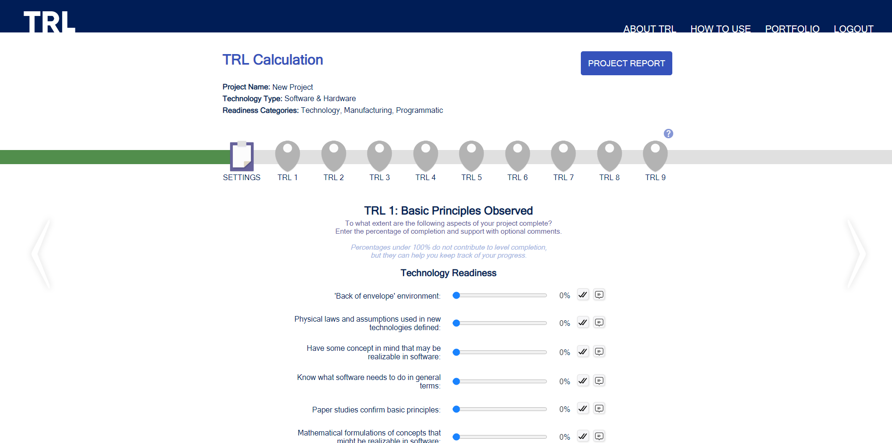

# TRL Calculator

## Description
The TRL Calculator web application (http://sable.dcs.gla.ac.uk/) was developed by a team of Level 3 Computing Science students at the University of Glasgow.

The Technology Readiness Level (TRL) scale was created by NASA to measure the maturity of new technologies. The University of Glasgow Reasearch & Innovation Services proposed the creation of a cloud-based version of the calculator, to support innovation activities within the University by providing academics with:​
> (a) A realistic understanding of the maturity of their innovations​

> (b) A roadmap of what is needed to achieve a higher TRL​.

The goal of the application is to deliver a more intuitive, user friendly and interactive version of the original TRL Calculator.

## Features
Tha application supports the following features:
- Multiple project management.
- Interactive roadmap with instant feedback.
- Export to PDF: Summary and Extended Version.
- "How to use" video tutorials of the application.
- University of Glasgow authentication functionality.

## Visuals

### Homepage

### Edit Project Page

### Project Report Page

## Installation

### Pre-requisites
- Clone the repository to your folder of choice.
- Make sure to have Python installed in your system.
  - https://www.python.org/downloads/
- Create a virtual environment:
  - **python -m venv trlvenv**
- Enter this virtual environment:
  - **source trlvenv/bin/activate** (Linux/MacOS)
  - **trlvenv\Scripts\activate** (Windows)
- Install required packages/libraries.
  - **python install.py**
- In sh30-main/settings.py:
  - Option 1: Set **DEBUG=True**, for detailed traceback messages (can't access custom error pages)
  - Option 2: Set **DEBUG=False**, to work with custom error pages (mandatory at deployment stage)
- Create a copy of **.env.template** named **.env** in the root directory. _Never share or commit this._  
  - For local use: Replace **token** with the provided GitLab access token. Ensure **SERVER=False**.
  - For server deployment: Replace **token** with the provided GitLab access token. Ensure **SERVER=True**.

### MySQL

- Install MySQL Server.
- Create the database:
  - **CREATE DATABASE trldatabase;**
- Create the user:
  - **CREATE USER '**\<provided username\>**'@'localhost' IDENTIFIED BY '**\<provided password\>**';**
- Grant privileges to the database:
  - **GRANT ALL PRIVILEGES ON trldatabase.\* TO '**\<provided username\>**'@'localhost';** 
- Flush the privileges:
  - **FLUSH PRIVILEGES;**
- Grant privileges to the test database:
  - **GRANT ALL PRIVILEGES ON test_db.\* TO '**\<provided username\>**'@'localhost';** 

### Django
- Enter the virtual environment:
  - **source trlvenv/bin/activate** (Linux/MacOS)
  - **trlvenv\Scripts\activate** (Windows)
- Create the latest model migrations:
  - **python manage.py makemigrations trl**
- Apply the migrations:
  - **python manage.py migrate**
- Populate the database:
  - Option 1: **python trl.population.basic_structure_population.py**, to only include the basic structural elements required for the website (e.g. TRL levels)
  - Option 2: **python trl.population.mock_data_population.py**, to include mock user/project data on top of the above (for testing purposes)
- Create a superuser for managing your local database:
  - **python manage.py createsuperuser**
- If DEBUG=False:
  - **python manage.py collectstatic**
- Run the server:
  - **python manage.py runserver**

## Support
If you have any questions or concerns, please feel free to contact innovation@glasgow.ac.uk.

## Authors
This project was collaboratively developed as a coursework assignment during the third year of Computing Science at the University of Glasgow by the following students:
- Callum Holmes (2566493h@student.gla.ac.uk)
- Dongni Tao (2552846t@student.gla.ac.uk)
- Lukas Moers (2506458m@student.gla.ac.uk)
- Natadthep Kritsanaviparkporn (2822861k@student.gla.ac.uk)
- Stella Eva Tsiapali (2526934t@student.gla.ac.uk)

## License
All intellectual property rights, including copyright, trademarks, and any other rights associated with this TRL Calculator project, belong to the University of Glasgow.
